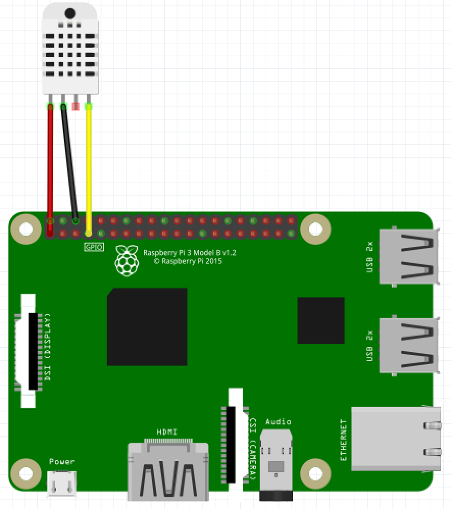

# insect_rasp

### overview ###
This is a humidity & temperature reader.  It use a sensor named "DHT22" and "Adafruit Python DHT" Sensor Library.

<em>Adafruit Python DHT</em>
<a target="ada_lef" href="https://github.com/adafruit/Adafruit_Python_DHT">https://github.com/adafruit/Adafruit_Python_DHT</a>

### requirements ###
You should install following tools on Raspbian.
<ul>
    <li>Python3</li>
    <li>Adafruit Python DHT Library </li>
    <li>GPIO Library(from pip3)</li>
</ul>

###  setup ###
<ol type="1">
    <li>connect wires.</li>
    <ul type="a">
      <li type="none"></li>
      <li type="none">wire connections</li>
      <li>POWER 3.3V:No.1 (red wire)</li>
      <li>GND:No.6 (black wire)</li>
      <li>DATA:No.7(GPIO 4, yellow wire)</li>
    </ul>
    <li>put "subscriber.py" to "adafruit Python DHT Library/subs".</li>
</ol>

###  usage ###
python subscriber.py &lt;GPIO&gt; &lt;POST_URL&gt; &lt;interval_second&gt;
python subscriber.py 4 http://localhost/api/pushto 30

now writing...

